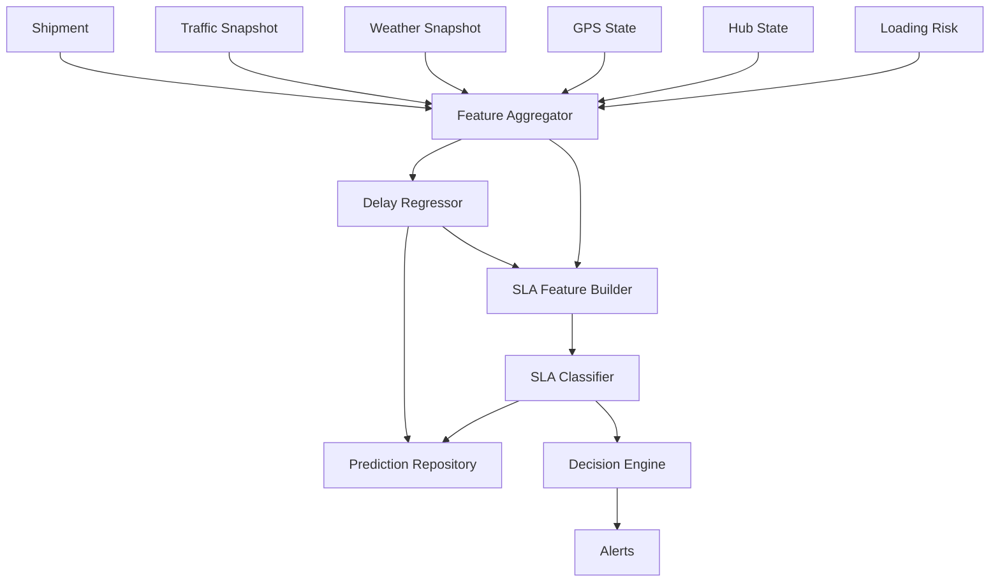
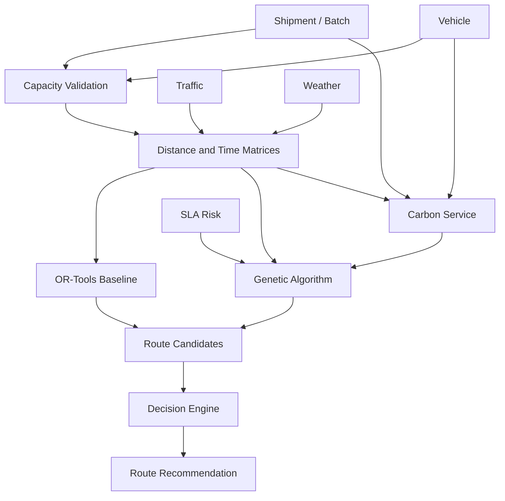
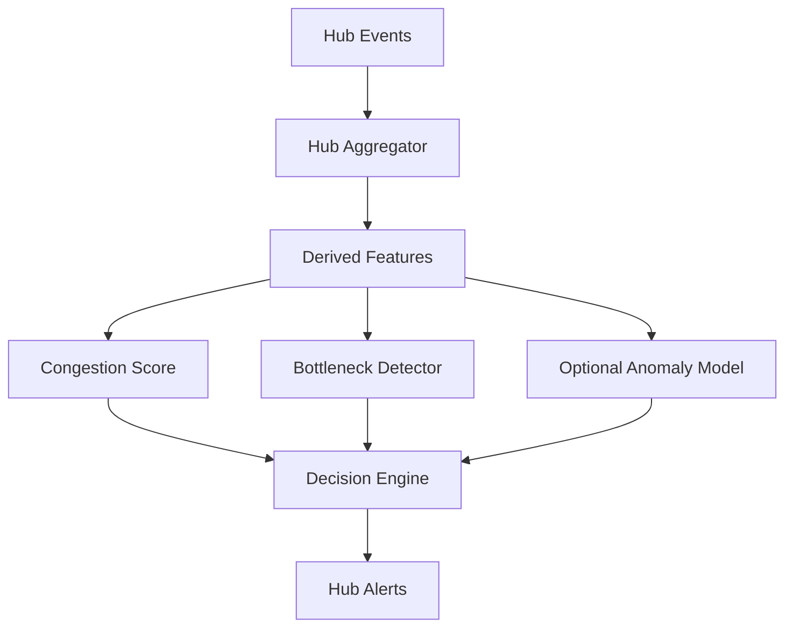

# LogiSense AI — Technical Architecture

## 1. Architecture Goal

The architecture must represent the competition's requested logical layers while remaining buildable by a student team.

Logical architecture:

```text
DATA SOURCES
    ↓
DATA INGESTION
    ↓
STORAGE
    ↓
ML / OPTIMIZATION LAYER
    ↓
DECISION ENGINE
    ↓
VISUALIZATION & ALERT SYSTEM
```

Implementation architecture:

```text
STREAMLIT FRONTEND
        ↓ REST
FASTAPI BACKEND
        ↓
SERVICES
        ↓
DOMAIN / ML / OPTIMIZATION MODULES
        ↓
REPOSITORIES
        ↓
SQLITE + LOCAL DATA LAKE
```

---

## 2. Dependency Direction

Allowed:

```text
Frontend → API
API → Services
Services → Domain Modules
Services → Repositories
Repositories → Database
Domain Modules → Config / Shared Schemas
```

Forbidden:

```text
Frontend → SQLite
Frontend → YOLO
Frontend → sklearn model
Frontend → OR-Tools
API route → SQL
API route → 150-line business logic
Repository → Service
Domain model → Streamlit
```

---

## 3. Frontend Layer

Technology:

- Streamlit;
- Plotly;
- Folium or streamlit-folium.

Responsibilities:

- collect user input;
- call API;
- display operational state;
- display model provenance;
- visualize routes;
- visualize risk;
- display alerts;
- export returned report data.

The frontend is not allowed to own domain calculations.

---

## 4. API Layer

Technology:

- FastAPI;
- Pydantic.

Responsibilities:

- HTTP endpoints;
- request validation;
- response schemas;
- error mapping;
- dependency construction.

Example:

```text
POST /api/risk/predict/SHP-1028
    ↓
risk router
    ↓
DeliveryRiskService.predict()
```

The API route should remain thin.

---

## 5. Service Layer

### DataIngestionService

- batch ingestion;
- simulation event ingestion.

### ShipmentService

- shipment context;
- operational snapshot.

### LoadingRiskService

- detector orchestration;
- loading rule evaluation.

### DeliveryRiskService

- feature aggregation;
- delay prediction;
- SLA scoring.

### CarbonService

- deterministic carbon baseline;
- optional carbon regressor.

### RouteOptimizationService

- capacity validation;
- candidate generation;
- route metrics;
- multi-objective optimization.

### HubRiskService

- hub feature aggregation;
- congestion scoring;
- bottleneck detection.

### FleetResilienceService

- utilization;
- high-use/underuse;
- maintenance feature aggregation.

### DecisionEngineService

- applies configurable operational policy.

### AlertService

- create;
- deduplicate;
- acknowledge.

### SimulationService

- event playback;
- state transition;
- module re-evaluation.

### AnalyticsService

- business impact aggregation.

---

## 6. Domain / Model Layer

Recommended structure:

```text
modules/
  loading/
  delivery_risk/
  routing/
  carbon/
  hub_risk/
  fleet/
  maintenance/
  decision_engine/
  simulation/
```

Each domain module is framework-agnostic.

Example:

```python
calculate_hub_congestion(features)
```

must work without FastAPI or Streamlit.

---

## 7. Repository Layer

Repositories are the normal database access boundary.

Example repositories:

```text
ShipmentRepository
VehicleRepository
HubRepository
TrafficRepository
WeatherRepository
GPSRepository
HubEventRepository
LoadingRepository
PredictionRepository
RouteRepository
AlertRepository
MaintenanceRepository
SimulationRepository
ModelRegistryRepository
```

Services should not contain raw SQL.

---

## 8. Storage Layer

### SQLite

Used for:

- current operational state;
- entities;
- events;
- predictions;
- alerts;
- recommendations.

### Local data lake

Folders:

```text
data/
  raw/
  interim/
  processed/
  demo/
```

Used for:

- generated training data;
- model-ready datasets;
- evaluation artifacts.

This approximates the competition's relational database + data lake architecture without unnecessary distributed infrastructure.

---

## 9. Model Loading Strategy

Each model has:

- path;
- version;
- feature list;
- training rows;
- dataset type;
- metrics metadata.

A model loader:

- loads lazily or once at app startup;
- validates metadata;
- exposes availability;
- activates fallback if missing.

Example states:

```text
AVAILABLE
FALLBACK
DEMO_MODE
ERROR
```

No silent model substitution.

---

## 10. Delivery Risk Data Flow



---

## 11. Route Optimization Data Flow



---

## 12. Hub Risk Data Flow



---

## 13. Simulation Architecture

Simulation event:

```json
{
  "event_id": "EVT-0042",
  "timestamp": "2026-07-05T12:42:00+07:00",
  "event_type": "TRAFFIC_UPDATE",
  "entity_id": "ROUTE-JKT-BKS-01",
  "payload": {
    "traffic_index": 0.91
  }
}
```

Processing:

```text
SimulationService.next()
        ↓
load next event
        ↓
apply state mutation
        ↓
identify affected entities
        ↓
rescore delivery risk
        ↓
reanalyze hub if needed
        ↓
decision engine
        ↓
reoptimize route if policy says required
        ↓
save predictions / decisions / alerts
        ↓
return updated SimulationState
```

The simulator is the MVP's near-real-time demonstration mechanism.

---

## 14. Decision Engine Architecture

The decision engine must not be an opaque LLM.

Inputs:

- model predictions;
- route metrics;
- hub risk;
- fleet risk;
- thresholds and policy.

Output:

```text
DecisionResult
- decision_type
- severity
- entity
- message
- recommendation
- evidence
```

Example:

```json
{
  "decision_type": "ROUTE_RECOMMENDATION",
  "severity": "Warning",
  "entity_id": "SHP-1028",
  "recommendation": "Use BALANCED_AI route",
  "evidence": {
    "current_sla_risk": 0.81,
    "recommended_sla_risk": 0.24,
    "current_co2_kg": 4.2,
    "recommended_co2_kg": 3.8
  }
}
```

---

## 15. Error Strategy

Domain errors:

```text
InvalidCapacityError
InvalidRouteWeightsError
ModelUnavailableError
InvalidImageError
EntityNotFoundError
SimulationStateError
```

FastAPI maps domain errors to HTTP responses.

Unexpected exceptions:

- log stack trace server-side;
- return generic error message to frontend.

Streamlit displays actionable error text.

---

## 16. API Client Strategy

`frontend/api_client.py` owns HTTP communication.

Methods should include:

```text
health()
list_shipments()
get_shipment()
list_vehicles()
list_hubs()
analyze_loading()
predict_risk()
optimize_routes()
reoptimize_routes()
analyze_hub()
analyze_fleet()
analyze_maintenance()
list_alerts()
acknowledge_alert()
simulation_reset()
simulation_next()
simulation_play()
simulation_pause()
simulation_state()
analytics_summary()
list_models()
executive_summary()
```

Pages must not duplicate `requests` code.

---

## 17. Recommended Repository Structure

```text
logisense-ai/
├── README.md
├── requirements.txt
├── .env.example
├── pytest.ini
│
├── docs/
│   ├── prd.md
│   ├── styleguide.md
│   ├── task.md
│   ├── architecture.md
│   ├── workflow.md
│   ├── implementation_plan.md
│   └── development_guidelines.md
│
├── frontend/
│   ├── app.py
│   ├── api_client.py
│   ├── session.py
│   ├── pages/
│   ├── components/
│   └── styles/
│
├── backend/
│   ├── main.py
│   ├── api/
│   ├── schemas/
│   ├── services/
│   └── exceptions.py
│
├── modules/
│   ├── loading/
│   ├── delivery_risk/
│   ├── routing/
│   ├── carbon/
│   ├── hub_risk/
│   ├── fleet/
│   ├── maintenance/
│   ├── decision_engine/
│   └── simulation/
│
├── database/
│   ├── connection.py
│   ├── schema.py
│   └── repositories/
│
├── config/
│   ├── settings.py
│   └── constants.py
│
├── data/
│   ├── raw/
│   ├── interim/
│   ├── processed/
│   └── demo/
│
├── models/
├── scripts/
└── tests/
```

---

## 18. Deployment View

MVP local development:

```text
Terminal 1
FastAPI
127.0.0.1:8000

Terminal 2
Streamlit
127.0.0.1:8501
```

Potential deployment:

```text
Streamlit frontend
        ↓
FastAPI service
        ↓
Persistent SQLite volume for demo
```

For production evolution:

```text
React/Next.js or Streamlit
        ↓
FastAPI
        ↓
PostgreSQL / Timescale
        ↓
Object Storage / Data Lake
        ↓
Streaming Platform
```

Production evolution is not an MVP requirement.
